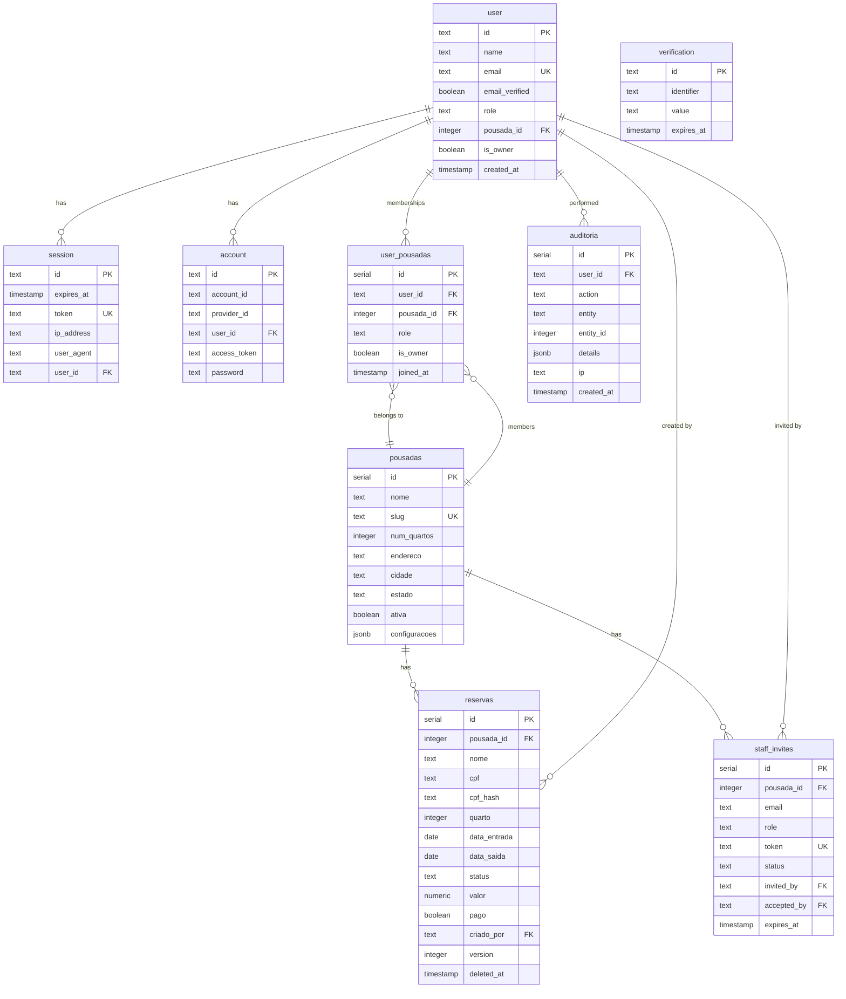
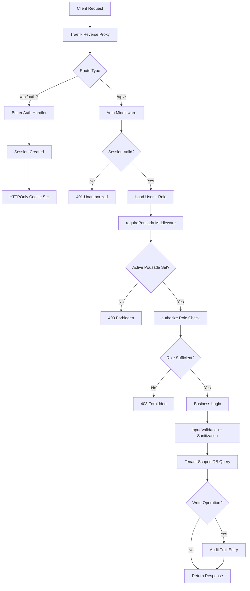

# Reservas Pousada

Multi-tenant SaaS for managing room reservations in Brazilian inns (pousadas). Owners register, create their pousada, invite staff by email, and manage rooms, reservations, and guests -- all tenant-isolated through a junction table with role-based access control.

**Production:** https://minhapousada.pgdev.com.br | **API:** https://api-pousada.pgdev.com.br

## Architecture

Three Docker containers (PostgreSQL 16, Express/TypeScript backend, Next.js frontend) behind Traefik v3 reverse proxy with automatic HTTPS.

Multi-tenancy is implemented through a `user_pousadas` junction table. A user can belong to multiple pousadas, each with an independent role. The `user.pousadaId` field stores the currently active pousada, and every database query is scoped to that value -- preventing cross-tenant data access at the query level.

Authentication is handled by Better Auth with HTTPOnly secure cookies (no JWTs in headers). Sessions expire after 24 hours with automatic cleanup every 6 hours. Google OAuth is supported alongside email/password with email verification.

RBAC enforces four roles:

| Role | Reservations | Pousada Config | Delete | Manage Users |
|---|---|---|---|---|
| owner | Full | Full | Yes | Yes |
| admin | CRUD | Config | Yes | Yes |
| recepcao | CRUD | Read | No | No |
| auditoria | Read | Read | No | No |

## Data Model

9 tables, 33 indexes, 7 migrations.



## Request Flow



## Security

**CPF encryption.** Guest CPF numbers are encrypted at rest using AES-256-GCM (application-layer, not database-layer). A SHA-256 hash stored in `cpf_hash` enables exact-match search without decryption. Authorized API responses return the plaintext CPF transparently.

**Session management.** HTTPOnly secure cookies with 24-hour expiry. Sessions are cleaned up automatically every 6 hours. No tokens are exposed to client-side JavaScript.

**Rate limiting.** 300 requests per 15 minutes per IP (global), 100 requests per minute on auth endpoints.

**Input handling.** All write endpoints pass through validation and sanitization functions (`sanitizarReserva`, `sanitizarPousada`, `sanitizarNome`, `sanitizarString`). CPF validation uses the full modulo-11 algorithm with both check digits. All queries use Drizzle ORM parameterized statements.

**Concurrency.** Optimistic locking via a `version` column on reservations prevents silent overwrites (returns HTTP 409 on conflict). An idempotency guard blocks duplicate reservations from double-clicks (same CPF + room + dates within 30 seconds).

**Headers.** HSTS, X-Frame-Options DENY, CSP, X-Content-Type-Options, X-XSS-Protection, Referrer-Policy, Permissions-Policy -- enforced by Traefik middleware.

## Tech Stack

| Component | Technology | Role |
|---|---|---|
| Backend | Node.js 20, Express.js, TypeScript | REST API server |
| ORM | Drizzle ORM | Type-safe queries, migrations |
| Database | PostgreSQL 16 | Primary data store |
| Frontend | Next.js 14, React 18, Tailwind CSS, shadcn/ui | SPA with SSR support |
| Auth | Better Auth | Session management, OAuth, RBAC |
| Email | Resend | Transactional emails (verification, invites, password reset) |
| Reverse Proxy | Traefik v3 | HTTPS via Let's Encrypt, security headers |
| Containerization | Docker, Docker Compose | Multi-stage builds, orchestration |

## Getting Started

### Prerequisites

- Docker 20+ and Docker Compose
- A Traefik instance on the `proxy` Docker network (for HTTPS)
- DNS A records pointing to the server for both frontend and API subdomains

### Environment Variables

Create a `.env` file in the project root:

```env
# Required
POSTGRES_USER=reservas
POSTGRES_PASSWORD=<strong password>
POSTGRES_DB=reservas_pousada
BETTER_AUTH_SECRET=<openssl rand -base64 32>
CPF_ENCRYPTION_KEY=<openssl rand -hex 32>

# Optional
GOOGLE_CLIENT_ID=
GOOGLE_CLIENT_SECRET=
RESEND_API_KEY=
```

The following are set automatically in `docker-compose.yml`: `DATABASE_URL`, `BETTER_AUTH_URL`, `CORS_ORIGIN`, `NEXT_PUBLIC_API_URL`.

### Running with Docker

```bash
cp .env.example .env
# Fill in all required values

docker compose up -d --build
docker compose logs -f
```

Traefik issues SSL certificates automatically. Verify the deployment:

```bash
# Check certificate
echo | openssl s_client -connect minhapousada.pgdev.com.br:443 2>/dev/null | openssl x509 -noout -subject -issuer

# Check security headers
curl -sI https://minhapousada.pgdev.com.br | grep -iE "strict-transport|x-frame|x-content"
```

### Local Development (without Docker)

```bash
# Backend
cd backend && npm install
npm run dev              # Express with hot reload (tsx watch)

# Frontend
cd frontend && npm install
npm run dev              # Next.js dev server

# Database migrations
cd backend
npm run db:generate      # Generate migration from schema changes
npm run db:migrate       # Run pending migrations
npm run db:push          # Push schema directly (dev only)
npm run db:studio        # Drizzle Studio GUI
```

## API Reference

### Auth (Better Auth -- automatic routes)

```
POST   /api/auth/sign-up           Register with email/password
POST   /api/auth/sign-in           Login (sets HTTPOnly cookie)
POST   /api/auth/sign-out          Logout (clears session)
GET    /api/auth/session           Current session info
POST   /api/auth/forget-password   Request password reset email
POST   /api/auth/reset-password    Reset password with token
```

### Reservations (requires auth + active pousada)

```
GET    /api/reservas                     List (paginated, filterable, max 200/page)
GET    /api/reservas/export              CSV export (max 5000 rows)
GET    /api/reservas/:id                 Get by ID (tenant-scoped)
GET    /api/reservas/:id/auditoria       Audit history for reservation
GET    /api/reservas/disponibilidade/:q  Room availability check
POST   /api/reservas                     Create (idempotency guard active)
PUT    /api/reservas/:id                 Update (optimistic locking)
PATCH  /api/reservas/:id/status          Change status (optimistic locking)
DELETE /api/reservas/:id                 Soft delete (owner/admin only)
```

### Pousadas (requires auth)

```
POST   /api/pousadas                     Create new pousada
GET    /api/pousadas/minha               Current active pousada
GET    /api/pousadas/minhas              All pousadas the user belongs to
POST   /api/pousadas/trocar              Switch active pousada
GET    /api/pousadas/:id                 Details
PUT    /api/pousadas/:id                 Update (owner/admin)
GET    /api/pousadas/:id/dashboard       Statistics (occupancy, revenue, check-ins)
GET    /api/pousadas/:id/quartos         List rooms
GET    /api/pousadas/:id/usuarios        List staff members
POST   /api/pousadas/:id/usuarios        Add staff member
DELETE /api/pousadas/:id/usuarios/:uid   Remove staff member
POST   /api/pousadas/:id/convites        Send staff invite email
GET    /api/pousadas/:id/convites        List pending invites
DELETE /api/pousadas/:id/convites/:iid   Revoke invite
```

### Staff Invites (public validation, auth required to accept)

```
GET    /api/convites/:token              Validate invite token (public)
POST   /api/convites/:token/aceitar      Accept invite (requires auth)
```

### Health

```
GET    /                                 API status
GET    /health                           Database connection check
```

## License

ISC
