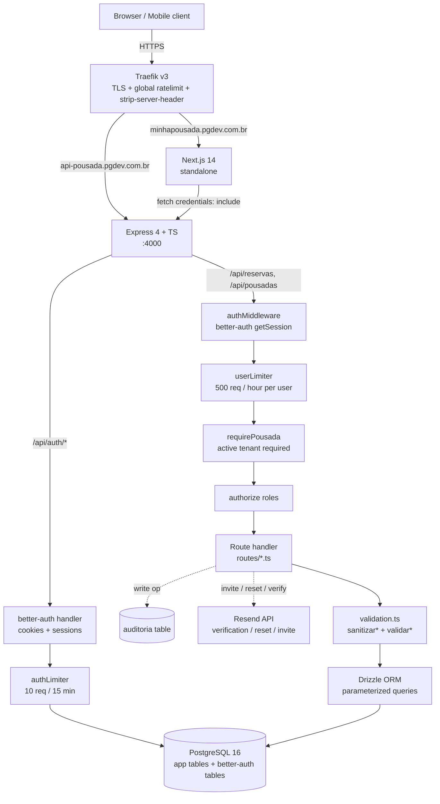
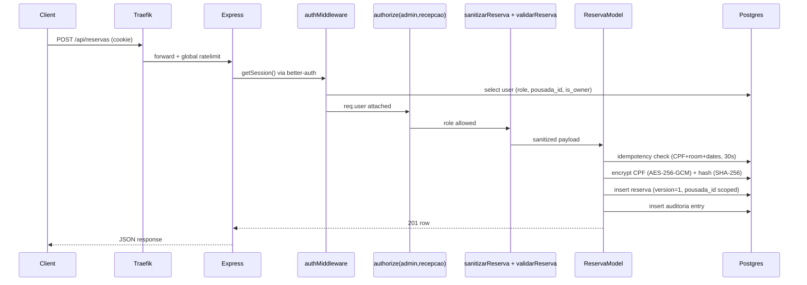
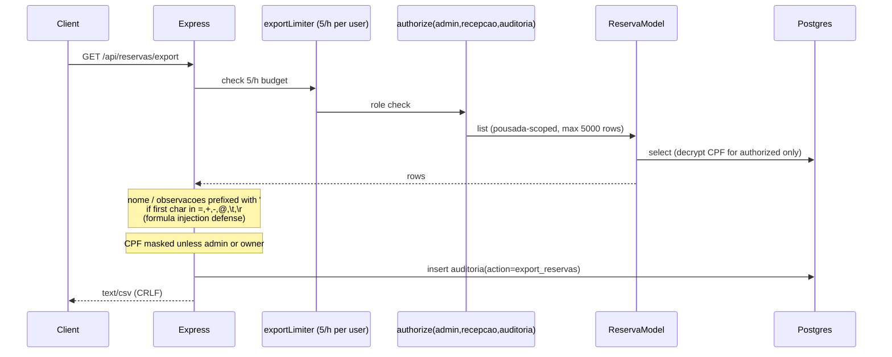

# Reservas Pousada

Multi-tenant SaaS for managing room reservations in Brazilian inns (pousadas). Owners register, create their pousada, invite staff by email, and manage rooms, reservations, and guests. All data is tenant-isolated through a junction table with role-based access control.

- Frontend: https://minhapousada.pgdev.com.br
- API: https://api-pousada.pgdev.com.br

## Overview

Three Docker services behind Traefik v3:

- `postgres` (PostgreSQL 16-alpine) on the `internal` network only
- `backend` (Express 4 + TypeScript, port 4000) on `internal` and `proxy`
- `frontend` (Next.js 14 standalone, port 3000) on `proxy`

Traefik terminates TLS (Let's Encrypt), enforces security headers, applies a global rate-limit middleware, and strips the `Server` response header. The backend exits on startup if `BETTER_AUTH_SECRET` is missing and warns if `RESEND_API_KEY` is unset in production.

Multi-tenancy uses a `user_pousadas` junction table. A user can belong to multiple pousadas, each with an independent role and an `is_owner` flag. The `user.pousada_id` column stores the user's currently active tenant; every domain query is scoped to that value, preventing cross-tenant reads at the query layer.

## Architecture



Reservation create flow (write path with all guards):



CSV export flow (read path with PII protections):



## Tech stack

Backend (`backend/package.json`):

- Node.js >=18, Express 4.21
- TypeScript 5.5, ESM (`"type": "module"`)
- `better-auth` 1.2.7 with `drizzle-adapter` and a node handler mounted at `/api/auth/*`
- `drizzle-orm` 0.45 + `drizzle-kit` 0.31, Postgres provider
- `pg` 8.13 (connection pool)
- `express-rate-limit` 7.1
- `resend` 6.9 for transactional email
- Build: `tsc` to `dist/`, dev: `tsx watch`

Frontend (`frontend/package.json`):

- Next.js 14.2 (standalone output, `poweredByHeader: false`)
- React 18.3
- Tailwind 3.4, `tailwindcss-animate`, shadcn/ui via `@radix-ui/react-slot`, `class-variance-authority`, `clsx`, `tailwind-merge`
- `better-auth` 1.2.7 client
- `lucide-react` icons, `gsap` 3.14

Infra:

- PostgreSQL 16-alpine, app+auth in one DB, app schema bootstrapped via `migrations/*.sql` mounted into `/docker-entrypoint-initdb.d`
- Traefik v3 (external `proxy` network), Let's Encrypt resolver `letsencrypt`
- Multi-stage Dockerfiles, non-root container users
- 256 MB memory cap per container

## Project structure

```
.
├── docker-compose.yml          postgres + backend + frontend, Traefik labels
├── .env.example                required env vars
├── backend/
│   ├── server.ts               app wiring, middleware stack, ratelimits, session evictor
│   ├── lib/
│   │   ├── auth.ts             better-auth config (12h session, sliding 1h refresh)
│   │   └── email.ts            Resend transport (verify, reset, invite)
│   ├── db/
│   │   ├── schema.ts           Drizzle schema (auth + app tables, indexes)
│   │   └── index.ts            pg pool + drizzle instance
│   ├── middleware/
│   │   ├── auth.ts             authMiddleware, requirePousada, requireOwner, authorize()
│   │   ├── activity.ts         request log
│   │   └── errorHandler.ts     AppError + global handler
│   ├── routes/
│   │   ├── reservas.ts         /api/reservas + /export + /:id/auditoria
│   │   ├── pousadas.ts         /api/pousadas + /:id/usuarios + /:id/convites
│   │   └── convites.ts         /api/convites/:token (public + accept)
│   ├── models/                 Reserva, Pousada, StaffInvite, Auditoria, Usuario
│   ├── utils/
│   │   ├── crypto.ts           AES-256-GCM CPF encryption + SHA-256 hash
│   │   └── validation.ts       CPF modulo-11, sanitizarReserva, sanitizarPousada
│   ├── migrations/             001..007 SQL files (schema, jsonb audit, invites,
│   │                            soft delete + indexes, junction unique, optimistic
│   │                            locking, CPF encryption)
│   └── Dockerfile              multi-stage, runs as `nodejs` (uid 1001)
└── frontend/
    ├── app/                    layout, /, /auth, /onboarding, /convite,
    │                            /forgot-password, /reset-password, /verify-email
    ├── components/             ui/ (shadcn), feature components
    ├── lib/                    api.ts (cookie-based fetch), types, formatters
    ├── next.config.js          standalone + poweredByHeader disabled
    └── Dockerfile              multi-stage Next.js standalone
```

## Security model

Authentication (`backend/lib/auth.ts`)

- `better-auth` with the Drizzle adapter against the `user`, `session`, `account`, `verification` tables.
- Email + password (8..100 chars), email verification on sign-up, password reset emails sent via Resend.
- Google OAuth (offline access, `prompt=select_account`) when `GOOGLE_CLIENT_*` are set.
- Session: 12h absolute lifetime, 1h sliding refresh (`updateAge`), 5-minute cookie cache.
- HTTPOnly secure cookies in production, no JWTs in headers, no client-side tokens.

Authorization (`backend/middleware/auth.ts`)

- `authMiddleware` calls `auth.api.getSession()` and re-loads the user row to attach role / `pousadaId` / `isOwner` to `req.user`.
- `requirePousada` enforces an active tenant; otherwise 403 with `needsOnboarding: true`.
- `requireOwner` blocks non-owners.
- `authorize(allowedRoles)` is a factory that **throws on construction** if `allowedRoles` is empty or not an array (footgun removal). Owners always pass.

Roles:

| Role        | Reservations | Pousada config | Delete   | Manage staff |
|-------------|--------------|----------------|----------|--------------|
| owner       | full         | full           | yes      | yes          |
| admin       | CRUD         | config         | yes      | yes          |
| recepcao    | CRUD         | read           | no       | no           |
| auditoria   | read         | read           | no       | no           |

Rate limiting

- Traefik: `global-ratelimit@file` + `strip-server-header@file` chained on both routers.
- Express global: 300 requests / 15 min per IP on `/api/`.
- Auth-endpoint limiter: 10 requests / 15 min per IP on `/api/auth/sign-in`, `/sign-in/email`, `/sign-up/email`, `/forget-password`. Successful sign-ins do not consume the budget.
- Per-user authenticated limiter: 500 requests / hour, keyed by `req.user.id`.
- CSV export: 5 requests / hour per user.

Session hygiene

- Background sweep deletes `WHERE expires_at < NOW()` every 6 hours.
- After a successful `POST /api/auth/change-password` or `/change-email`, all other sessions for the user are deleted (current session preserved). Implemented as a `res.on('finish')` interceptor that runs only on 2xx responses.
- After a successful invite acceptance, `auth.api.revokeOtherSessions()` is called to defeat session-pinning across role changes.

Invite acceptance (`backend/models/StaffInvite.ts`, `backend/routes/convites.ts`)

- Token lookup is public (`GET /api/convites/:token`) and returns 404 / 410 for missing / used / expired.
- Acceptance requires authentication, and the authenticated user's email must match the invite recipient (case-insensitive). Otherwise the model throws.
- On accept: status flipped to `accepted`, junction row created if not present, other sessions revoked.

Reservations

- Optimistic locking via a `version` column on `reservas`. Updates and status changes return HTTP 409 on stale writes.
- Idempotency guard: identical (CPF + room + dates) within 30s rejects duplicates from double-clicks.
- Soft delete (`deleted_at`); `DELETE` requires `admin` or owner.

CSV export (`backend/routes/reservas.ts`)

- Authorized to `admin`, `recepcao`, `auditoria`, plus owner. Limit 5000 rows.
- Customer-supplied fields (`nome`, `observacoes`) are prefixed with `'` when starting with `=`, `+`, `-`, `@`, tab, or CR — blocks formula injection in Excel / LibreOffice / Sheets.
- CPF is masked (`***.***.***-NN`) for everyone except admins and owner.
- CRLF line endings (Excel-friendly).
- Each export inserts an audit log row (`export_reservas`, with `rowCount` and `masked` flag).

CPF protection (`backend/utils/crypto.ts`)

- AES-256-GCM at rest, 96-bit IV, 128-bit auth tag, format `iv:authTag:ciphertext` (base64).
- `cpf_hash` (SHA-256 of normalized digits) enables exact-match lookup without decryption.
- `CPF_ENCRYPTION_KEY` must be 32 raw bytes (64 hex). The module throws on misconfiguration.

Validation

- `validarCPF()` runs the full modulo-11 algorithm with both check digits.
- `sanitizarReserva`, `sanitizarPousada`, `sanitizarNome`, `sanitizarString` neutralize `< > " ' &` and clamp lengths before any DB write.
- All queries use Drizzle parameterized SQL.

Headers

- Express: `X-Content-Type-Options: nosniff`, `X-Frame-Options: DENY`, `X-XSS-Protection`, `Referrer-Policy: strict-origin-when-cross-origin`, `Permissions-Policy: geolocation=(), microphone=(), camera=()`, HSTS in production, `x-powered-by` disabled.
- Traefik per-router: HSTS preload, `frameDeny`, `contentTypeNosniff`, `referrerPolicy`, plus a strict CSP (`default-src 'none'` for the API; site CSP for the frontend).
- Next.js: `poweredByHeader: false`.

Audit trail

- `auditoria` table records `action`, `entity`, `entity_id`, `pousada_id`, `details` (jsonb), `ip`, `user_id`, `created_at`. Writes to reservations and CSV exports always emit an entry.

## Local development

Prerequisites: Docker 20+, Docker Compose, a Traefik instance attached to the external `proxy` network (only required for production-style deploys).

Environment file (`.env` at repo root, see `.env.example`):

```env
POSTGRES_USER=reservas
POSTGRES_PASSWORD=...                          # strong
POSTGRES_DB=reservas_pousada
BETTER_AUTH_SECRET=...                         # openssl rand -base64 32
CPF_ENCRYPTION_KEY=...                         # openssl rand -hex 32
GOOGLE_CLIENT_ID=                              # optional
GOOGLE_CLIENT_SECRET=                          # optional
RESEND_API_KEY=                                # optional in dev
```

`DATABASE_URL`, `BETTER_AUTH_URL`, `CORS_ORIGIN`, `NEXT_PUBLIC_API_URL` are injected by `docker-compose.yml`.

Run with Docker:

```bash
cp .env.example .env
# fill in the required values

docker compose up -d --build
docker compose logs -f
```

Run without Docker:

```bash
# backend
cd backend
npm install
npm run dev                  # tsx watch on server.ts

# frontend
cd ../frontend
npm install
npm run dev                  # next dev on :3000

# Drizzle
cd ../backend
npm run db:generate          # generate migration from schema diff
npm run db:migrate           # apply pending migrations
npm run db:push              # dev-only direct push
npm run db:studio            # GUI

# manual JSON backup of the DB
npm run backup
```

## Deployment notes

The compose file expects:

- Traefik on the external `proxy` network with an `https` entrypoint and a `letsencrypt` cert resolver.
- Two Traefik file-provider middlewares available: `global-ratelimit@file` and `strip-server-header@file`.
- DNS A records for `api-pousada.pgdev.com.br` and `minhapousada.pgdev.com.br`.

Database migrations under `backend/migrations/` are mounted read-only into Postgres' `/docker-entrypoint-initdb.d`, so they only run on a fresh volume. For schema changes against an existing volume, run `npm run db:migrate` from the backend container.

Verification:

```bash
# certificate
echo | openssl s_client -connect minhapousada.pgdev.com.br:443 2>/dev/null \
  | openssl x509 -noout -subject -issuer

# headers
curl -sI https://minhapousada.pgdev.com.br | grep -iE "strict-transport|x-frame|x-content"
curl -sI https://api-pousada.pgdev.com.br | grep -iE "strict-transport|x-frame|x-content"
```

## API surface

Mounted in `backend/server.ts`:

- `app.all('/api/auth/*', toNodeHandler(auth))` — better-auth handles its own routing
- `app.use('/api/convites', conviteRoutes)` — public token validation + authenticated accept
- `app.use('/api/reservas', authMiddleware, userLimiter, requirePousada, reservaRoutes)`
- `app.use('/api/pousadas', authMiddleware, userLimiter, pousadaRoutes)`

### Auth (better-auth)

```
POST   /api/auth/sign-up/email          register, sends verification email
POST   /api/auth/sign-in/email          login (HTTPOnly cookie)
POST   /api/auth/sign-out               logout
GET    /api/auth/session                current session
POST   /api/auth/forget-password        request password reset
POST   /api/auth/reset-password         consume reset token
POST   /api/auth/change-password        evicts other sessions on success
POST   /api/auth/change-email           evicts other sessions on success
GET    /api/auth/sign-in/google         Google OAuth start (when configured)
```

### Reservations (auth + active pousada)

```
GET    /api/reservas                          list, paginated, max 200/page
GET    /api/reservas/export                   CSV, max 5000 rows, 5/hour, masked CPF for non-admin/owner
GET    /api/reservas/:id                      tenant-scoped fetch
GET    /api/reservas/:id/auditoria            audit history for one reserva
GET    /api/reservas/disponibilidade/:quarto  room availability
POST   /api/reservas                          create, idempotency guard, encrypts CPF
PUT    /api/reservas/:id                      update, optimistic locking (409 on conflict)
PATCH  /api/reservas/:id/status               status change, optimistic locking
DELETE /api/reservas/:id                      soft delete, admin or owner
```

### Pousadas (auth)

```
POST   /api/pousadas                          create new pousada (becomes owner)
GET    /api/pousadas/minha                    active pousada
GET    /api/pousadas/minhas                   all memberships
POST   /api/pousadas/trocar                   switch active pousada
GET    /api/pousadas/:id                      details (member only)
PUT    /api/pousadas/:id                      update (owner)
GET    /api/pousadas/:id/dashboard            occupancy, revenue, check-ins (SQL-aggregated)
GET    /api/pousadas/:id/quartos              rooms
GET    /api/pousadas/:id/usuarios             staff list (owner)
POST   /api/pousadas/:id/usuarios             attach existing user (owner)
DELETE /api/pousadas/:id/usuarios/:userId     detach staff (owner)
POST   /api/pousadas/:id/desativar            deactivate (owner)
POST   /api/pousadas/:id/reativar             reactivate (owner)
POST   /api/pousadas/:id/convites             send invite email (owner)
GET    /api/pousadas/:id/convites             pending invites (owner)
DELETE /api/pousadas/:id/convites/:inviteId   revoke invite (owner)
```

### Invites

```
GET    /api/convites/:token                   public, validates token (404 / 410 for missing / used / expired)
POST   /api/convites/:token/aceitar           auth required, email must match recipient, revokes other sessions
```

### Health

```
GET    /                                      API status
GET    /health                                DB connectivity probe
```

## License

ISC
