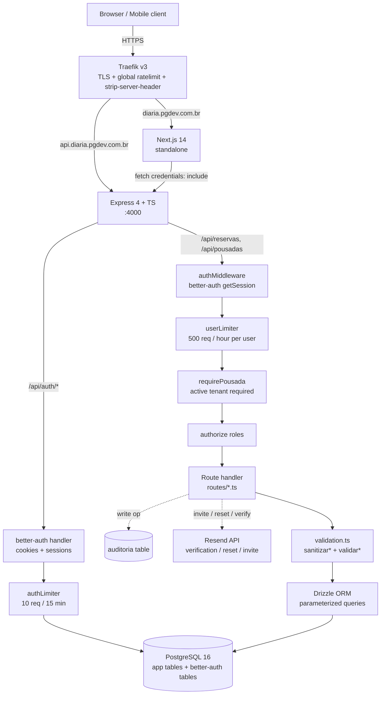
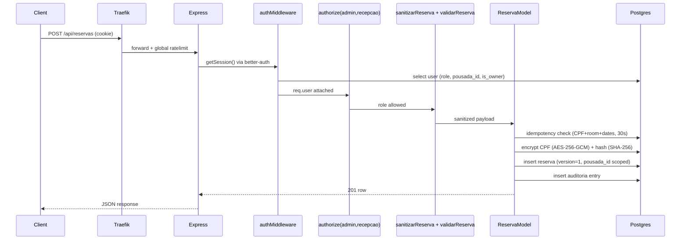
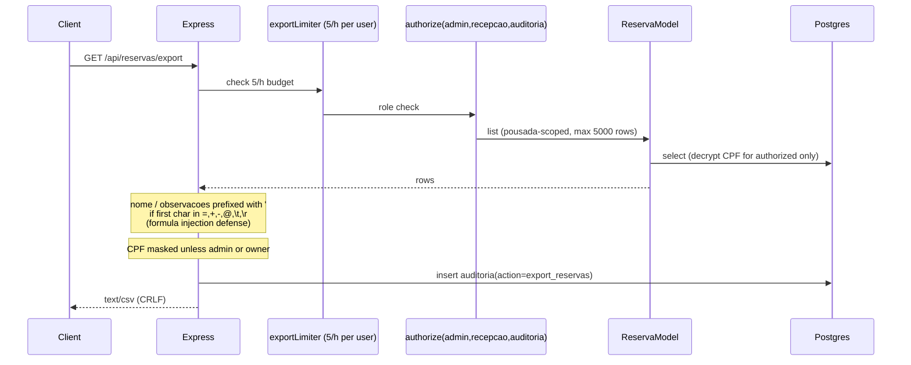

# Diária

Multi-tenant SaaS for managing room reservations in Brazilian inns (pousadas). Owners register, create their pousada, invite staff by email, and manage rooms, reservations, and guests. All data is tenant-isolated through a junction table with role-based access control.

- Frontend: https://diaria.pgdev.com.br
- API: https://api.diaria.pgdev.com.br

## Features

- **Occupancy map**: rooms × days grid (half-day columns so same-day turnover sits side by side), click an empty slot to book.
- **Reservation lifecycle**: pre-reservation with a deadline (auto-cancelled by a job when it lapses) → confirmed → checked in → checked out, plus cancelled (with reason) and no-show. Transitions validated server-side; check-in requires the guest's document.
- **Guests as records**: CPF, passport or other document (encrypted + HMAC), WhatsApp with country code, e-mail, nationality, stay history; deduplicated by document (or name + phone).
- **Reservation account**: deposit, partial payments, refunds and extra consumption; balance always derived, `pago` kept in sync.
- **Rates**: season / weekday / per-room rules (fixed price or percentage) with minimum stay; the reservation form suggests the price night by night.
- **iCal sync** with Booking/Airbnb: per-room secret export feed (no guest data), imported OTA calendars every 30 min become reservations (so the DB overbooking guard covers them too); SSRF-guarded fetch.
- **Reports**: occupancy, ADR, RevPAR, revenue by channel (accrual), cash received by payment method, receivables.
- **CSV import** from Excel/Google Sheets with dry-run preview, per-row errors, idempotent re-import.
- **Public booking page** `/r/<slug>`: availability with tariff prices, request becomes a pre-reservation (channel `site`) with deadline; abuse limits (per-IP rate limit, honeypot, max open requests per phone).
- **Pix for the deposit**: BR Code "copia e cola" + QR built from the inn's own Pix key (manual "Recebi o Pix"), or automatic confirmation through the inn's own **Asaas** account (key stored encrypted, webhook registered via API, authenticated by header and re-checked against the Asaas API). Gateways sit behind `lib/gatewayPix.ts` (`GatewayPix`), so Pagar.me & co. plug in without touching the rest. Webhook URLs use `API_PUBLIC_URL` (falls back to `BETTER_AUTH_URL`).
- **Online pre-check-in (FNRH fields)**: each reservation gets a secret link `/checkin/<token>`; the guest fills in their registration card and companions' before arriving. The card is stored AES-encrypted, completes the guest record (document → check-in allowed), shows "ficha ✓" in the agenda, can be viewed/printed by the front desk, closes on check-in/cancellation, and is deleted by the retention job.
- **WhatsApp**: ready messages (confirmation, deposit request, arrival instructions, thank-you) that open the inn's own WhatsApp via `wa.me` with the text filled in — editable per inn with `{variables}`, available on the reservation page and in the daily agenda (no API, no cost). A daily job sends the arrival reminder the day before (for inns that opt in) through the inn's own connected number, or through an optional platform number (`WHATSAPP_TOKEN`, `WHATSAPP_PHONE_NUMBER_ID`, `WHATSAPP_MODELO_LEMBRETE`, `WHATSAPP_IDIOMA`), using the template `lembrete_chegada` with body variables `{{1}}` guest first name, `{{2}}` inn, `{{3}}` arrival date (dd/mm), `{{4}}` room; guests who replied "parar" are skipped.
- **WhatsApp Business per inn + virtual attendant**: each inn connects its own number from Settings via Meta's Embedded Signup (we are the Tech Provider; coexistence with the WhatsApp Business phone app supported). Token stored AES-encrypted; one signed webhook (`/api/webhooks/whatsapp`, `X-Hub-Signature-256` over the raw body) routes events by `phone_number_id` into a pg-boss queue; default utility templates are created on connect. Conversations page `/whatsapp` for the front desk (reply within the 24h window, hand back to the agent). Optional LLM attendant (`AGENTE_*`, Anthropic or any OpenAI-compatible API) with server-side tools (inn info, real availability and tariff prices, pre-reservation with Pix, the sender's own reservations, call a human); it never confirms payments, cancels or changes bookings. Human handoff by keyword, by tool, on media messages, on model failure or after the per-inn daily cap, with an e-mail to the inn; "parar"/"voltar" opt-out; staff replies (panel or phone echo) pause the agent for 12h; messages encrypted and purged after 90 days. Meta setup checklist in [`docs/whatsapp-meta.md`](docs/whatsapp-meta.md).
- Team roles (owner/admin, front desk, auditor), multi-property (Rede plan), Stripe billing, LGPD tooling (export, deletion, retention).

## Overview

Three Docker services behind Traefik v3:

- `postgres` (PostgreSQL 16-alpine) on the `internal` network only
- `backend` (Express 5 + TypeScript, port 4000) on `internal` and `proxy`
- `frontend` (Next.js 15 standalone, port 3000) on `proxy`

Traefik terminates TLS (Let's Encrypt), enforces security headers, applies a global rate-limit middleware, and strips the `Server` response header. The backend exits on startup if `BETTER_AUTH_SECRET` is missing and warns if `RESEND_API_KEY` is unset in production.

Multi-tenancy uses a `user_pousadas` junction table. A user can belong to multiple pousadas, each with an independent role and an `is_owner` flag. The active tenant is chosen **per browser tab**: the frontend sends `X-Pousada-Id` on every request and `authMiddleware` validates it against `user_pousadas` (role and owner flag come from that membership row). Without the header, `user.pousada_id` (the last pousada chosen) is used. Every domain query is scoped to the resolved tenant.

Background work (transactional e-mail with retries, session/rate-limit cleanup, automatic check-out of past stays, pre-reservation expiry, iCal sync, guest-data anonymization, ad conversions) runs on **pg-boss**, a job queue stored in the same Postgres (schema `pgboss`).

## Architecture


```mermaid
flowchart TD
    Client[Browser / Mobile client]
    Traefik[Traefik v3<br/>TLS + global ratelimit + strip-server-header]
    Frontend[Next.js 14<br/>standalone]
    Backend[Express 4 + TS<br/>:4000]
    AuthMW[authMiddleware<br/>better-auth getSession]
    AuthLimit[authLimiter<br/>10 req / 15 min]
    UserLimit[userLimiter<br/>500 req / hour per user]
    ReqPousada[requirePousada<br/>active tenant required]
    Authorize[authorize roles]
    Routes[Route handler<br/>routes/*.ts]
    Sanitize[validation.ts<br/>sanitizar* + validar*]
    Drizzle[Drizzle ORM<br/>parameterized queries]
    PG[(PostgreSQL 16<br/>app tables + better-auth tables)]
    Audit[(auditoria table)]
    Resend[Resend API<br/>verification / reset / invite]

    Client -->|HTTPS| Traefik
    Traefik -->|diaria.pgdev.com.br| Frontend
    Traefik -->|api.diaria.pgdev.com.br| Backend
    Frontend -->|fetch credentials: include| Backend

    Backend -->|/api/auth/*| BetterAuth[better-auth handler<br/>cookies + sessions]
    BetterAuth --> AuthLimit
    AuthLimit --> PG

    Backend -->|/api/reservas, /api/pousadas| AuthMW
    AuthMW --> UserLimit
    UserLimit --> ReqPousada
    ReqPousada --> Authorize
    Authorize --> Routes
    Routes --> Sanitize
    Sanitize --> Drizzle
    Drizzle --> PG
    Routes -.write op.-> Audit
    Routes -.invite / reset / verify.-> Resend
```

Reservation create flow (write path with all guards):


```mermaid
sequenceDiagram
    participant C as Client
    participant T as Traefik
    participant API as Express
    participant A as authMiddleware
    participant Z as authorize(admin,recepcao)
    participant V as sanitizarReserva + validarReserva
    participant M as ReservaModel
    participant DB as Postgres

    C->>T: POST /api/reservas (cookie)
    T->>API: forward + global ratelimit
    API->>A: getSession() via better-auth
    A->>DB: select user (role, pousada_id, is_owner)
    A->>Z: req.user attached
    Z->>V: role allowed
    V->>M: sanitized payload
    M->>DB: idempotency check (CPF+room+dates, 30s)
    M->>DB: encrypt CPF (AES-256-GCM) + hash (SHA-256)
    M->>DB: insert reserva (version=1, pousada_id scoped)
    M->>DB: insert auditoria entry
    M-->>API: 201 row
    API-->>C: JSON response
```

CSV export flow (read path with PII protections):


```mermaid
sequenceDiagram
    participant C as Client
    participant API as Express
    participant L as exportLimiter (5/h per user)
    participant Z as authorize(admin,recepcao,auditoria)
    participant M as ReservaModel
    participant DB as Postgres

    C->>API: GET /api/reservas/export
    API->>L: check 5/h budget
    L->>Z: role check
    Z->>M: list (pousada-scoped, max 5000 rows)
    M->>DB: select (decrypt CPF for authorized only)
    M-->>API: rows
    Note over API: nome / observacoes prefixed with '<br/>if first char in =,+,-,@,\t,\r<br/>(formula injection defense)
    Note over API: CPF masked unless admin or owner
    API->>DB: insert auditoria(action=export_reservas)
    API-->>C: text/csv (CRLF)
```

## Tech stack

Backend (`backend/package.json`):

- Node.js 22, Express 5 (async errors reach the error handler)
- TypeScript 5.5, ESM (`"type": "module"`)
- `better-auth` 1.7 with `drizzle-adapter`, mounted at `/api/auth/{*caminho}`
- `drizzle-orm` 0.45.3 + `drizzle-kit` 0.31, Postgres provider
- `pg` (connection pool, size/timeouts via env, `statement_timeout`)
- `pg-boss` 12 (job queue in Postgres)
- `express-rate-limit` 7.5 with a shared Postgres store (`utils/rateLimitStore.ts`)
- `stripe` 22 (billing), `resend` 6.9 (e-mail), `@sentry/node` 10 (optional)
- Build: `tsc` to `dist/`, dev: `tsx watch`. `app.ts` builds the Express app; `server.ts` boots it (migrations, queue, listen)

Frontend (`frontend/package.json`):

- Next.js 15.5 (App Router, standalone output, `poweredByHeader: false`), React 19
- Public pages rendered on the server: `/` (landing), `/cadastro`, `/entrar`, `/privacidade`, `/termos`, plus `sitemap.xml`, `robots.txt` and a generated Open Graph image
- Logged-in area under `app/(app)`: `/painel`, `/mapa`, `/reservas`, `/reservas/nova`, `/reservas/[id]` (with the account panel), `/reservas/importar`, `/hospedes`, `/hospedes/[id]`, `/quartos` (rooms, rates, iCal), `/relatorios`, `/configuracoes` (shared session context, auth/onboarding guards, auto-refresh on focus and every 60s)
- Tailwind 3.4, shadcn/ui primitives, `better-auth` 1.7 client
- GA4 / Meta Pixel loaded only after cookie consent; first-touch UTM attribution sent on sign-up

Infra:

- PostgreSQL 16-alpine (hosted in the shared `central-db` instance), app+auth in one DB, schema applied by the versioned migration runner at boot
- Traefik v3 (external `proxy` network), Let's Encrypt resolver `letsencrypt`
- Multi-stage Dockerfiles, non-root container users
- 256 MB memory cap per container

## Project structure

```
.
├── docker-compose.yml          postgres + backend + frontend, Traefik labels
├── .env.example                required env vars
├── backend/
│   ├── server.ts               app wiring, middleware stack, ratelimits, session evictor
│   ├── lib/
│   │   ├── auth.ts             better-auth config (12h session, sliding 1h refresh)
│   │   └── email.ts            Resend transport (verify, reset, invite)
│   ├── db/
│   │   ├── schema.ts           Drizzle schema (auth + app tables, indexes)
│   │   └── index.ts            pg pool + drizzle instance
│   ├── middleware/
│   │   ├── auth.ts             authMiddleware, requirePousada, requireOwner, authorize()
│   │   ├── activity.ts         request log
│   │   └── errorHandler.ts     AppError + global handler
│   ├── routes/
│   │   ├── reservas.ts         /api/reservas + /export + /:id/auditoria
│   │   ├── pousadas.ts         /api/pousadas + /:id/usuarios + /:id/convites
│   │   └── convites.ts         /api/convites/:token (public + accept)
│   ├── models/                 Reserva, Pousada, StaffInvite, Auditoria, Usuario
│   ├── utils/
│   │   ├── crypto.ts           AES-256-GCM CPF encryption + SHA-256 hash
│   │   └── validation.ts       CPF modulo-11, sanitizarReserva, sanitizarPousada
│   ├── migrations/             001..007 SQL files (schema, jsonb audit, invites,
│   │                            soft delete + indexes, junction unique, optimistic
│   │                            locking, CPF encryption)
│   └── Dockerfile              multi-stage, runs as `nodejs` (uid 1001)
└── frontend/
    ├── app/                    layout, /, /auth, /onboarding, /convite,
    │                            /forgot-password, /reset-password, /verify-email
    ├── components/             ui/ (shadcn), feature components
    ├── lib/                    api.ts (cookie-based fetch), types, formatters
    ├── next.config.js          standalone + poweredByHeader disabled
    └── Dockerfile              multi-stage Next.js standalone
```

## Security model

Authentication (`backend/lib/auth.ts`)

- `better-auth` with the Drizzle adapter against the `user`, `session`, `account`, `verification` tables.
- Email + password (8..100 chars). **E-mail must be verified before the first sign-in** (`requireEmailVerification`); signing in unverified re-sends the link. Password reset via Resend.
- Google OAuth (`prompt=select_account`, no offline token) only registered when `GOOGLE_CLIENT_*` are set; the login screen asks `GET /api/config` and shows the button only then. The OAuth state carries the destination (invite, page that asked for login), the marketing attribution and the error return (`/entrar?error=<code>`).
- Session: 12h absolute lifetime, 1h sliding refresh (`updateAge`), 5-minute cookie cache.
- HTTPOnly secure cookies in production, no JWTs in headers, no client-side tokens.

Authorization (`backend/middleware/auth.ts`)

- `authMiddleware` calls `auth.api.getSession()`, then in one query loads the user and the `user_pousadas` row for the requested tenant (`X-Pousada-Id`, or the default). A tenant the user does not belong to → 403 `pousadaInvalida`; malformed header → 400. Role and `isOwner` come from the membership row.
- `requirePousada` enforces an active tenant; otherwise 403 with `needsOnboarding: true`.
- `requireOwner` blocks non-owners.
- `authorize(allowedRoles)` is a factory that **throws on construction** if `allowedRoles` is empty or not an array (footgun removal). Owners always pass.

Roles:

| Role        | Reservations | Pousada config | Delete   | Manage staff |
|-------------|--------------|----------------|----------|--------------|
| owner       | full         | full           | yes      | yes          |
| admin       | CRUD         | config         | yes      | yes          |
| recepcao    | CRUD         | read           | no       | no           |
| auditoria   | read         | read           | no       | no           |

Rate limiting

- Traefik: `global-ratelimit@file` + `strip-server-header@file` chained on both routers.
- Express global: 300 requests / 15 min per IP on `/api/`.
- Auth-endpoint limiter: 10 requests / 15 min on `/api/auth/sign-in`, `/sign-in/email`, `/forget-password`. Successful sign-ins do not consume the budget.
- Sign-up has its own limiter (5 / hour) that does **not** skip successful requests — otherwise creating real accounts was unlimited.
- All IP-based limiters key on the **/64 prefix** for IPv6 (`utils/rede.ts`). Keying on the full address gave any attacker with an IPv6 block an effectively unlimited budget.
- Per-user authenticated limiter: 500 requests / hour, keyed by `req.user.id`.
- CSV export: 5 requests / hour per user.

Session hygiene

- Background sweep deletes `WHERE expires_at < NOW()` every 6 hours.
- After a successful `POST /api/auth/change-password` or `/change-email`, all other sessions for the user are deleted (current session preserved). Implemented as a `res.on('finish')` interceptor that runs only on 2xx responses.
- After a successful invite acceptance, `auth.api.revokeOtherSessions()` is called to defeat session-pinning across role changes.

Invite acceptance (`backend/models/StaffInvite.ts`, `backend/routes/convites.ts`)

- Token lookup is public (`GET /api/convites/:token`) and returns 404 / 410 for missing / used / expired.
- Acceptance requires authentication, and the authenticated user's email must match the invite recipient (case-insensitive). Otherwise the model throws.
- On accept: status flipped to `accepted`, junction row created if not present, other sessions revoked.

Reservations

- **No overbooking, guaranteed by the database**: `EXCLUDE USING gist (pousada_id WITH =, quarto WITH =, daterange(data_entrada, data_saida, '[)') WITH &&) WHERE (status IN ('pre_reserva', 'confirmada', 'hospedada') AND deleted_at IS NULL)`. Reservations imported from OTA calendars go through the same constraint; a clash is reported as possible overbooking instead of being written. Concurrent bookings for the same room cannot both land; the loser gets HTTP 409. The application-level availability check remains only to produce a helpful message.
- Date ranges are **half-open** `[check-in, check-out)`: a guest leaving on the 12th frees the room for a guest arriving on the 12th.
- Optimistic locking via a `version` column on `reservas`. Updates and status changes return HTTP 409 on stale writes.
- Idempotency guard: identical (guest + room + dates) within 30s returns the existing reservation (double-click).
- Soft delete (`deleted_at`); `DELETE` requires `admin` or owner.

CSV export (`backend/routes/reservas.ts`)

- Authorized to `admin`, `recepcao`, `auditoria`, plus owner. Limit 5000 rows.
- Customer-supplied fields (`nome`, `observacoes`) are prefixed with `'` when starting with `=`, `+`, `-`, `@`, tab, or CR — blocks formula injection in Excel / LibreOffice / Sheets.
- Guest document is masked (`***.***.***-NN` for CPF, last 3 characters otherwise) for everyone except admins and owner.
- CRLF line endings (Excel-friendly).
- Each export inserts an audit log row (`export_reservas`, with `rowCount` and `masked` flag).

CPF protection (`backend/utils/crypto.ts`)

- AES-256-GCM at rest, 96-bit IV, 128-bit auth tag, format `iv:authTag:ciphertext` (base64).
- `cpf_hash` is an **HMAC-SHA-256** keyed with `CPF_ENCRYPTION_KEY` (domain-separated), enabling exact-match lookup without decryption. A plain SHA-256 would be brute-forceable over the ~10^9 valid CPFs in about 24 minutes on one core, which would defeat the AES column next to it.
- `CPF_ENCRYPTION_KEY` must be 32 raw bytes (64 hex). Validated at boot (`assertCpfCryptoConfigurada`) — the server exits rather than start, because a missing key previously caused CPFs to be written in plaintext silently.
- Partial CPF search is impossible by construction (the column holds ciphertext); only exact match via the HMAC works.

Validation

- `validarCPF()` runs the full modulo-11 algorithm with both check digits.
- `sanitizarReserva`, `sanitizarPousada`, `sanitizarNome`, `sanitizarString` neutralize `< > " ' &` and clamp lengths before any DB write.
- All queries use Drizzle parameterized SQL.

Headers

- Express: `X-Content-Type-Options: nosniff`, `X-Frame-Options: DENY`, `X-XSS-Protection`, `Referrer-Policy: strict-origin-when-cross-origin`, `Permissions-Policy: geolocation=(), microphone=(), camera=()`, HSTS in production, `x-powered-by` disabled.
- Traefik per-router: HSTS preload, `frameDeny`, `contentTypeNosniff`, `referrerPolicy`, plus a strict CSP (`default-src 'none'` for the API; site CSP for the frontend).
- Next.js: `poweredByHeader: false`.

Audit trail

- `auditoria` table records `action`, `entity`, `entity_id`, `details` (jsonb), `ip`, `user_id`, `created_at`.
- There is **no** `pousada_id` column: tenant isolation is enforced at read time in `AuditoriaModel.listar`, which requires a `pousadaId` and scopes by a subquery over the owning table. Unknown entities raise rather than return cross-tenant rows.
- `details` is passed through `redigirPII` before insert, so `cpf` / `cpf_hash` are stored as `[redigido]` — the encrypted column is not undone by the audit trail.
- Writes to reservations and CSV exports always emit an entry.

## Local development

Prerequisites: Docker 20+, Docker Compose, a Traefik instance attached to the external `proxy` network (only required for production-style deploys).

Environment file (`.env` at repo root, see `.env.example`):

```env
POSTGRES_USER=reservas
POSTGRES_PASSWORD=...                          # strong
POSTGRES_DB=reservas_pousada
BETTER_AUTH_SECRET=...                         # openssl rand -base64 32   (server exits if missing)
CPF_ENCRYPTION_KEY=...                         # openssl rand -hex 32      (server exits if missing)
APP_TIMEZONE=America/Sao_Paulo                 # optional, this is the default
GOOGLE_CLIENT_ID=                              # optional
GOOGLE_CLIENT_SECRET=                          # optional
RESEND_API_KEY=                                # optional in dev
```

Both secrets are fatal at boot on purpose. `BETTER_AUTH_SECRET` was already;
`CPF_ENCRYPTION_KEY` was not, and running without it caused every CPF to be
written to the database in plaintext with no error and no log entry.

`DATABASE_URL`, `BETTER_AUTH_URL`, `CORS_ORIGIN`, `NEXT_PUBLIC_API_URL` are injected by `docker-compose.yml`.

Run with Docker:

```bash
cp .env.example .env
# fill in the required values

docker compose up -d --build
docker compose logs -f
```

Run without Docker:

```bash
# backend
cd backend
npm install
npm run dev                  # tsx watch on server.ts

# frontend
cd ../frontend
npm install
npm run dev                  # next dev on :3000

# Drizzle
cd ../backend
npm run db:generate          # generate migration from schema diff
npm run db:migrate           # apply pending migrations
npm run db:push              # dev-only direct push
npm run db:studio            # GUI

# tests (unit; the DB suite runs too when DATABASE_URL is set)
npm test
npm run typecheck
```

## Deployment notes

The compose file expects:

- Traefik on the external `proxy` network with an `https` entrypoint and a `letsencrypt` cert resolver.
- Two Traefik file-provider middlewares available: `global-ratelimit@file` and `strip-server-header@file`.
- DNS A records for `api.diaria.pgdev.com.br` and `diaria.pgdev.com.br`.

Database migrations under `backend/migrations/` are applied by a versioned runner (`db/migrate.ts`) at boot, inside a transaction per file, tracked in `schema_migrations` and serialized across instances with a Postgres advisory lock. A migration that fails aborts startup deliberately — the server never runs against a schema it does not expect.

A clean `001` → `009` run against an empty database is exercised on every CI build (`tests/banco.test.ts`), so "deploy from scratch" is a tested path rather than an assumption.

### Release and rollback

Every push to `main` that passes CI publishes both images twice: tagged with the
first 12 characters of the commit SHA (immutable) and as `latest` (what the VPS
auto-pull consumes).

Roll back to a known-good version on the VPS:

```bash
# pick the SHA from the GitHub Actions run summary ("Publicado: <sha>")
echo "IMAGE_TAG=<sha>" >> .env
docker compose pull backend frontend && docker compose up -d backend frontend
```

Remove the `IMAGE_TAG` line to go back to following `latest`. Migrations are
forward-only: rolling back the code does not undo a migration, so a release that
changes the schema must stay compatible with the previous code for one version.

Health endpoints: `/health/live` (process up — used by the Docker healthcheck)
and `/health` (also checks Postgres; returns 503 when the database is
unreachable — point the external uptime monitor here).

Scaling the API to more than one replica: rate-limit counters already live in
Postgres (shared), and the migration runner is serialized by an advisory lock.
Remove `container_name` from the `backend` service, size `DB_POOL_MAX` so that
replicas × pool fits in the shared database's `max_connections`, then
`docker compose up -d --scale backend=2`.

Verification:

```bash
# certificate
echo | openssl s_client -connect diaria.pgdev.com.br:443 2>/dev/null \
  | openssl x509 -noout -subject -issuer

# headers
curl -sI https://diaria.pgdev.com.br | grep -iE "strict-transport|x-frame|x-content"
curl -sI https://api.diaria.pgdev.com.br | grep -iE "strict-transport|x-frame|x-content"
```

## API surface

Mounted in `backend/app.ts`. Every authenticated route accepts `X-Pousada-Id`.

### Auth (better-auth)

```
POST   /api/auth/sign-up/email          register (no session until the e-mail is verified); accepts `origem` (UTM attribution)
POST   /api/auth/sign-in/email          login (HTTPOnly cookie); 403 EMAIL_NOT_VERIFIED re-sends the link
POST   /api/auth/sign-out               logout
GET    /api/auth/get-session            current session
POST   /api/auth/forget-password        request password reset
POST   /api/auth/reset-password         consume reset token
POST   /api/auth/change-password        evicts other sessions on success
POST   /api/auth/sign-in/social         Google OAuth start (when configured)
GET    /api/config                      public install info for the login screen ({ google })
```

### Reservations (auth + active pousada + subscription in good standing)

```
GET    /api/reservas                          list, paginated (max 200/page), CPF always masked
GET    /api/reservas/agenda?data=&dias=       arrivals, departures, in-house and upcoming arrivals
GET    /api/reservas/export                   CSV (max 5000 rows, 5/hour); full CPF only for admin/owner
GET    /api/reservas/:id                      detail; full CPF for owner/admin/reception (audited), masked for auditoria
GET    /api/reservas/:id/auditoria            audit history
GET    /api/reservas/disponibilidade/:quarto  availability (conflicts return only id/name/room/dates/status)
POST   /api/reservas                          create (room must exist in the pousada)
PUT    /api/reservas/:id                      update, optimistic locking (409 on conflict)
PATCH  /api/reservas/:id/status               status change, optimistic locking
DELETE /api/reservas/:id                      soft delete, admin or owner
```

### WhatsApp Business (auth + active pousada + subscription in good standing)

```
GET    /api/whatsapp/config                      public bits for the Embedded Signup (app id, config id) + availability
GET    /api/whatsapp/conta                       connection status (never the token)
POST   /api/whatsapp/conectar                    owner/admin: { code, waba_id, phone_number_id, coexistencia }
POST   /api/whatsapp/desconectar                 owner/admin
PUT    /api/whatsapp/agente                      owner/admin: { ativo } — virtual attendant on/off
GET    /api/whatsapp/conversas                   owner/admin/front desk
GET    /api/whatsapp/conversas/:id               messages (decrypted)
POST   /api/whatsapp/conversas/:id/responder     staff reply within the 24h window (pauses the agent for 12h)
POST   /api/whatsapp/conversas/:id/agente        hand the conversation back to the agent
GET    /api/webhooks/whatsapp                    Meta verification (hub.challenge)
POST   /api/webhooks/whatsapp                    Meta events, X-Hub-Signature-256 checked over the raw body
```

### Pousadas (auth)

```
POST   /api/pousadas                          create (name + rooms; plan limits and Rede coverage decided in-transaction)
GET    /api/pousadas/minha                    active pousada (for this tab)
GET    /api/pousadas/minhas                   all memberships
POST   /api/pousadas/trocar                   set the default pousada for new tabs
GET    /api/pousadas/:id                      details (member)
PUT    /api/pousadas/:id                      update (owner/admin); refuses removing rooms with current reservations
DELETE /api/pousadas/:id                      definitive deletion (owner, body {confirmacao: <exact name>})
GET    /api/pousadas/:id/dashboard            today's occupancy, revenue, receivables
GET    /api/pousadas/:id/usuarios             team (owner/admin)
PATCH  /api/pousadas/:id/usuarios/:userId     change role (only the owner grants/revokes admin)
DELETE /api/pousadas/:id/usuarios/:userId     remove member (access ends immediately)
POST   /api/pousadas/:id/convites             invite (plan limit counts pending invites)
GET    /api/pousadas/:id/convites             invites
POST   /api/pousadas/:id/convites/:id/reenviar resend (renews 7 days)
DELETE /api/pousadas/:id/convites/:inviteId   revoke
```

Joining a team is invite-only (the old "attach user by id" route was removed).

### Invites

```
GET    /api/convites/:token                   public, validates token (404 / 410)
POST   /api/convites/:token/aceitar           auth + verified e-mail matching the invite; checks the plan's user limit
```

### Billing (auth)

```
GET    /api/billing/situacao                  subscription state (effective one, for pousadas covered by a Rede plan)
GET    /api/billing/planos                    sellable plans
POST   /api/billing/checkout                  owner; refused when a live Stripe subscription exists
POST   /api/billing/trocar-plano              owner; updates the existing subscription with proration
POST   /api/billing/portal                    owner; Stripe customer portal
POST   /api/webhooks/stripe                   signed webhook; event record and effects in one transaction
```

### Account (LGPD) and misc

```
GET    /api/conta/exportar                    the user's own data as JSON
DELETE /api/conta                             anonymize own account (body {confirmacao: "EXCLUIR"})
POST   /api/telemetria/erro                   browser error reports (public, rate-limited)
GET    /api/admin/margem                      margin per tenant (ADMIN_EMAILS + verified e-mail)
GET    /api/admin/aquisicao?dias=             sign-ups → pousadas → paying, per acquisition channel
```

### Health

```
GET    /health/live                           process is up (Docker healthcheck)
GET    /health                                also checks Postgres; 503 when unreachable (uptime monitor)
```

## Planned work

- [`docs/plano-de-correcao.md`](docs/plano-de-correcao.md) — the fix/evolution
  plan from the Oct/2026 audit (Phase 0 done; Phase 1: rooms, availability map,
  guests, payments, status cycle, rates, iCal, reports, import; Phase 2: booking
  engine, Pix, WhatsApp, online pre-check-in, PWA, WhatsApp Business per inn with
  virtual attendant).
- [`docs/deploy-producao.md`](docs/deploy-producao.md) — production go-live runbook:
  VPS secrets, Resend, GitHub Variables for the `NEXT_PUBLIC_*` build args, backup,
  monitoring, Google OAuth, Stripe, GA4/Meta, WhatsApp, smoke test.
- [`docs/whatsapp-meta.md`](docs/whatsapp-meta.md) — what to set up at Meta (Tech
  Provider, Embedded Signup configuration, webhook, App Review) and the env vars.

Design decisions recorded before implementation, so the reasoning survives the
conversation that produced it:

- [`docs/chat-ia-dashboard.md`](docs/chat-ia-dashboard.md) — natural-language chat
  over each tenant's own reservation data. **Deferred, not cancelled**: the
  feature bills per question against a product that has no billing yet, and the
  database has no reservations to answer from. The document records the
  prerequisites, the architecture (fixed read-only tools with the tenant injected
  server-side — never text-to-SQL, never RAG), why CPF must not enter the model
  context, and the cost model.

## License

ISC
